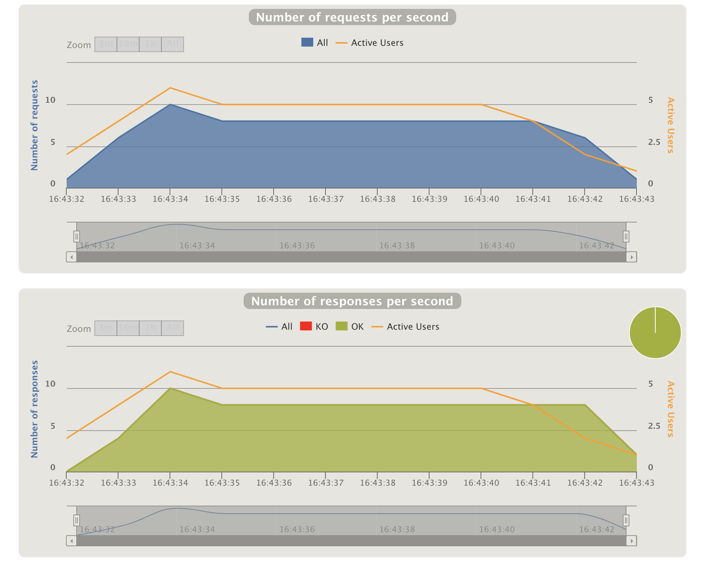

class: center, middle

# Gatling Introduction

---

# Agenda

* Introduction
* Setup
* Simulations
* Checks
* Assertions

---

# Introduction

## What is Gatling?
An automated load testing tool which provides a Scala DSL for describing tests scenarios.

Scenarios might be thought as scripts for executing HTTP requests.

Scenarios are stored in regular .scala files.

https://gatling.io/docs/current

##Common uses

Test HTTP services response on heavy load.

In addition to HTTP, Gatling supports JMS and MQTT protocols as well.

---

#Setup

Gatling can run stand alone, as part of ScalaTest tests or as an **SBT** plugin:

`plugins.sbt`:
```scala
addSbtPlugin("io.gatling" % "gatling-sbt" % "3.0.0")
```

`build.sbt`:
```scala
lazy val root = (project in file(".")).enablePlugins(PlayScala, GatlingPlugin)

libraryDependencies += "io.gatling.highcharts" % "gatling-charts-highcharts" % "3.0.0" % "test,it"
libraryDependencies += "io.gatling"            % "gatling-test-framework"    % "3.0.0" % "test,it"
```

**IMPORTANT:** Simulations must live under **`test/scala`** directory in order to Gatling SBT plugin to find them.

---


#Simulations

## A complete example
```scala
import io.gatling.core.Predef._
import io.gatling.http.Predef._
import scala.concurrent.duration._

class ImageImportFromUrlSimulation {
 // We can pass parameters as system properties
 val serviceBaseUrl = System.getProperty("serviceBaseUrl", "http://localhost:9000")
 val imageUrl = System.getProperty("imageUrl", "http://localhost:9000/photo/no_photo/no_photo.jpeg")

 // HTTP client configuration
 val httpConf = http
   .baseUrl(serviceBaseUrl)
   .acceptEncodingHeader("gzip, deflate")
```

continued...

---

```scala
 // The test scenario
 val scn = scenario("Image import from URL")
   .exec(http("import_from_url")
     .post("/import-from-url") // execute POST to the /import-from-url endpoint
     .header("Content-Type", "application/json")
     .body(StringBody(s"""{ "url": "$imageUrl" }""")).asJson // using this JSON body
     .check(status.is(201)))

 setUp(
   scn.inject(rampUsers(300) during (10 seconds))
 ).protocols(httpConf)
   .assertions(
     global.successfulRequests.percent.is(100) // Al requests should succeed
   )
}
```

---

## Generating requests

```scala
setUp(
  scn.inject(rampUsers(300) during (10 seconds))
)
```

Other injection expressions:

* atOnceUsers(numberOfUsers)
* constantUsersPerSec(rate) during (duration)
* rampUsersPerSec(rate1) to (rate2) during(duration)

---

## Checks
Verify structure of HTTP responses.

HTTP status: `check(status.is(201)))`, `check(status.not(500))`

CSS selector: `check(css("article.more a", "href"))`

More on: https://gatling.io/docs/current/http/http_check

### Capture
Checks also allows to capture data and reuse it in the simulation:

```scala
.exec(http("Search")
  .get("/computers?f=mac")
  .check(css("a:contains('${searchComputerName}')", "href").saveAs("computerURL")))
.pause(1)
.exec(http("Select")
  .get("${computerURL}"))
```

```scala
headerRegex("FOO", "foo(.*)bar(.*)baz").ofType[(String, String)]
```

---

## Assertions
Used for verifying SLAs.

They are composed of: metric + condition

```scala
setUp(scn).assertions(
  global.responseTime.max.lt(50),
  global.successfulRequests.percent.gt(95)
)
```

### More metrics

* `responseTime`: target the response time in milliseconds.
* `allRequests`: target the number of requests.
* `failedRequests`: target the number of failed requests.
* `successfulRequests`: target the number of successful requests.
* `requestsPerSec`: target the rate of requests per second

---

### Conditions

Conditions compare **the value** of the metric and the **threshold**:

* `lt(threshold)`: the value is less than the threshold.
* `lte(threshold)`: the value is less than or equal to the threshold.
* `gt(threshold)`: the value is greater than the threshold.
* `gte(threshold)`: the value is greater than or equal to the threshold.
* `between(thresholdMin, thresholdMax)`: the value is between two thresholds.
* `between(thresholdMin, thresholdMax, inclusive = false)`: same as above but doesn’t include bounds
* `is(value)`: the value is equal to the given value.
* `in(sequence)`: the value of metric is in a sequence.

---

## Run Simulations
```bash
sbt gatling:test
```

## Reports
`sbt gatling:test` should output something like:

```
Reports generated in 0s.
Please open the following file: target/gatling/computerworld-20181211194330455/index.html
```

Here `computerworld-20181211194330455/index.html` contains the reports for the simulation run.

There are many `index.html` report files as simulations defined in the project, and the time of their execution.

---



---
# Conclusion:

## In real world, unit tests are not enough.
## But we can do something about it!

.center[]

.footnote[(Picture credit: https://automationpanda.com/2017/05/18/can-performance-tests-be-unit-test/)]
